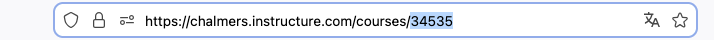

# TimeEdit to Canvas Calendar Importer

A Python script that imports calendar events from TimeEdit CSV exports into Canvas LMS course calendars.

## Features

- Import multiple events from TimeEdit CSV export to Canvas calendar
- Support for both English and Swedish languages
- No external dependencies - uses only Python standard library
- Timezone conversion (CET/CEST to UTC)
- Detailed event information including course codes, activities, and locations
- Interactive confirmation before creating events

## Requirements

- Python 3.6 or higher
- Canvas LMS account with API access
- TimeEdit CSV export file

## Installation

1. Clone this repository:
```bash
git clone <repository-url>
cd canvas_calendar_api
```

2. No additional dependencies needed - the script uses only Python standard library!

## Configuration

### 1. Create Canvas Access Token

1. Log into Canvas and go to **Account → Settings**
2. Scroll down to **Approved Integrations**
3. Click **+ New Access Token**
4. Fill in the details (purpose, expiry date, etc.)
5. Copy the generated token

### 2. Find Course ID

1. Navigate to your course in Canvas
2. Look at the URL in your browser address bar
3. The course ID is the number at the end of the URL (e.g., `https://canvas.instructure.com/courses/12345` → course ID is `12345`)



### 3. Export from TimeEdit

1. Go to your course schedule in TimeEdit
2. Set the date range for the events you want to export
3. Click **Download** / **Ladda ner**
4. Choose **CSV** format
5. Save the CSV file to the same folder as the script

### 4. Configure the Script

Edit the configuration section in `timeedit_csv_to_canvas.py`:

```python
CANVAS_DOMAIN = "chalmers.instructure.com"  # Your Canvas domain
API_TOKEN = "ADD YOUR API TOKEN HERE"       # Paste your Canvas API token
COURSE_ID = "ADD YOUR COURSE ID HERE"       # Your course ID (e.g., "12345")
CSV_FILE = "ADD YOUR CSV FILE PATH HERE"    # Path to your TimeEdit CSV file
LANGUAGE = "en"                              # "en" for English or "sv" for Swedish
TIMEZONE_OFFSET = 1                          # 1 for winter time (CET), 2 for summer time (CEST)
```

## Usage

1. Make sure you've completed all configuration steps above
2. Run the script:
```bash
python3 timeedit_csv_to_canvas.py
```

3. Review the events that will be created
4. Confirm to proceed with the import
5. The script will create all events in your Canvas course calendar

## Tips & Workflow

### Editing Before Import
You can edit the CSV file before running the script to customize what gets imported:
- Open the CSV file in a spreadsheet application or text editor
- Remove rows for events you don't want to import (e.g., exam periods, breaks, or unnecessary sessions)
- Save the file before running the import script

This gives you full control over which events appear in your Canvas calendar.

### Editing After Import
After importing events to Canvas, you can still make changes directly in the Canvas calendar:
- Edit event details (title, description, time, location)
- Delete individual events
- Move events to different dates/times

All Canvas calendar editing features remain available after import.

## Timezone Notes

- **Winter Time** (late October - late March): Set `TIMEZONE_OFFSET = 1` (CET = UTC+1)
- **Summer Time** (late March - late October): Set `TIMEZONE_OFFSET = 2` (CEST = UTC+2)

If events appear at the wrong time in Canvas, adjust the `TIMEZONE_OFFSET` setting.

## Security Notes

- Never commit your API token to version control
- Keep your Canvas API token secure and don't share it
- The API token gives access to your Canvas account
- You can revoke tokens at any time in Canvas settings

## License

This project is open source and available under the MIT License.
